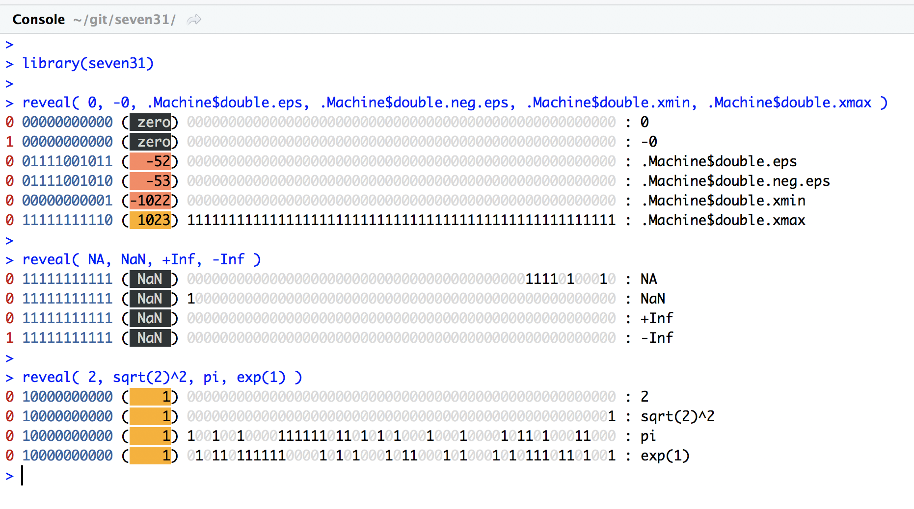
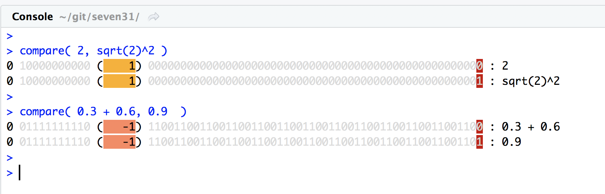

<!-- README.md is generated from README.Rmd. Please edit that file -->

```{r, echo = FALSE}
knitr::opts_chunk$set(
  collapse = TRUE,
  comment = "#>",
  fig.path = "README-"
)
```

## R FAQ 7.31

is probably the most [famous FAQ](https://cran.r-project.org/doc/FAQ/R-FAQ.html#Why-doesn_0027t-R-think-these-numbers-are-equal_003f), so it deserves its own 📦 to help you 🕵️ the confusion of

```{r}
0.3 + 0.6 == 0.9
sqrt(2)^2 == 2
```

This [wikipedia article](https://en.wikipedia.org/wiki/Double-precision_floating-point_format) 
is a good introduction to the Double-precision floating-point format, but in short 
`double` (what we call `numeric` in R) are encoded in 64 bits: 

  - the first bit is the sign bit
  - the 11 following bits are the exponent
  - the remaining 52 bits are the fraction


## Installation

From github: 

```R
devtools::install_github( "ThinkRstat/seven31" )
```

## ShReveal the bits`reveal` 🔍 the binary representation of numbers. It takes a variadic number of arguments
and shows their representation with some [‼️](http://rlang.tidyverse.org) magic.  On a 🖍 compatible 
environment, you get a nice colored output: 



## Compare two numbers

`compare` shows the differences. On 🖍 compatible environments, the bits that differ between the two numbers
are highlighted with 🔴 background. 


