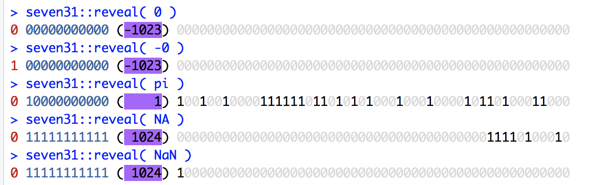
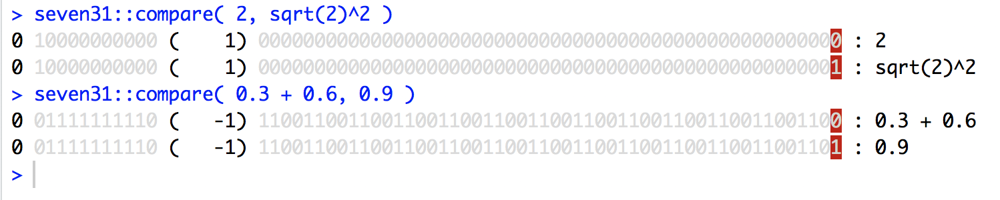

<!-- README.md is generated from README.Rmd. Please edit that file -->
R FAQ 7.31
----------

is probably the most [famous FAQ](https://cran.r-project.org/doc/FAQ/R-FAQ.html#Why-doesn_0027t-R-think-these-numbers-are-equal_003f), so it deserves its own 📦 to help you 🕵️ the confusion of

``` r
0.3 + 0.6 == 0.9
#> [1] FALSE
sqrt(2)^2 == 2
#> [1] FALSE
```

This [wikipedia article](https://en.wikipedia.org/wiki/Double-precision_floating-point_format) is a good introduction to the Double-precision floating-point format, but in short `double` (what we call `numeric` in R) are encoded in 64 bits:

-   the first bit is the sign bit
-   the 11 following bits are the exponent
-   the remaining 52 bits are the fraction

Installation
------------

From github:

``` r
devtools::install_github( "ThinkRstat/seven31" )
```

ShReveal the bits`reveal` 🔍 the binary representation of numbers. It takes a variadic number of arguments
---------------------------------------------------------------------------------------------------------

and shows their representation with some [‼️](http://rlang.tidyverse.org) magic. On a 🖍 compatible environment, you get a nice colored output:



Compare two numbers
-------------------

`compare` shows the differences. On 🖍 compatible environments, the bits that differ between the two numbers are highlighted with 🔴 background.


